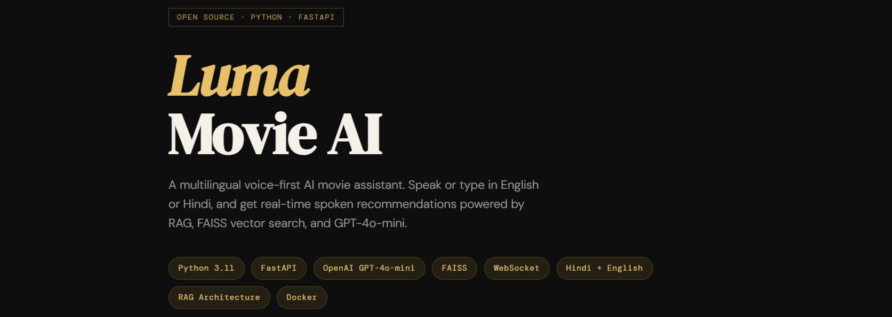

# 🎬 Luma — Multilingual Voice AI Movie Assistant

> A voice-first AI movie assistant that understands English & Hindi. Speak your mood, get real-time spoken recommendations — powered by RAG, FAISS vector search, and GPT-4o-mini.

<br>

[](https://python.org)
[](https://fastapi.tiangolo.com)
[](https://openai.com)
[](https://github.com/facebookresearch/faiss)
[](https://docker.com)
[](LICENSE)

---


## What is Luma?

Luma is a production-grade, voice-enabled AI assistant for movie discovery. You talk to it — in English or Hindi (including Hinglish) — and it talks back with spoken recommendations, movie cards, and follow-up questions.

Unlike a simple chatbot, Luma uses a **RAG (Retrieval-Augmented Generation)** pipeline: it first searches a database of 5,000 TMDB movies using semantic vector search, then asks an LLM to craft a warm, conversational recommendation grounded in those real results. No hallucinated movies. No invented plots.

```
You: "mujhe ek emotional sci-fi movie chahiye"
Luma: "Interstellar aur Arrival dono bahut achhe options hain. Interstellar ..."
       🔊 [spoken audio plays]   🎬 [movie cards appear]
```

---

## ✨ Features

| Feature | Description |
|---|---|
| 🎙️ **Real-time voice** | Live two-way conversation over WebSocket with barge-in support |
| 🔍 **Semantic search** | FAISS vector index over 5,000 TMDB movies + LLM re-ranking |
| 🌐 **Hindi + English** | Detects Hindi, Hinglish (romanized), and English automatically |
| ⚡ **Streaming audio** | First audio chunk plays before the full response is generated |
| 🧠 **Conversation memory** | JWT session tokens carry history across turns |
| 🛡️ **Production-ready** | Rate limiting, security headers (CSP/HSTS), Docker, Render deploy |
| 🚧 **Layered guardrails** | Three-layer content filter keeps Luma on-topic without LLM calls |
| 🔄 **Two-pass retrieval** | FAISS finds 20 candidates, GPT-4o-mini re-ranks to top 5 |

---

## 🏗️ Architecture

```
┌─────────────────────────────────────────────────────────┐
│                   User (browser / mic)                  │
└──────────────────────────┬──────────────────────────────┘
                           │ text or voice
┌──────────────────────────▼──────────────────────────────┐
│              FastAPI Server  (main.py)                  │
│     Rate limiting · Auth · Security headers             │
│   POST /recommend  │  POST /voice-chat  │  WS /ws/voice │
└────────┬───────────┴──────────┬─────────┴───────┬───────┘
         │                      │                  │
         ▼                      ▼                  ▼
  [Text query]          [Audio upload]      [Live mic stream]
         │                      │                  │
         │               ┌──────▼──────┐           │
         │               │ STT Service │           │
         │               │  (Whisper)  │           │
         │               └──────┬──────┘           │
         └──────────────────────┼──────────────────┘
                                │ transcribed text
                ┌───────────────▼────────────────┐
                │      LLM Service (Luma AI)     │
                │  Intent · Language · Guardrails│
                └──────────────┬─────────────────┘
                        ┌──────┴──────┐
                        │             │
               [recommendation]   [small talk /
                  intent           conversation]
                        │             │
          ┌─────────────▼──────┐      │
          │  Vector Retriever  │      │
          │  FAISS + reranking │      │
          │  (top 5 movies)    │      │
          └─────────────┬──────┘      │
                        │             │
          ┌─────────────▼─────────────▼──┐
          │     GPT-4o-mini generates    │
          │  warm, voice-optimized reply │
          └─────────────┬────────────────┘
                        │
          ┌─────────────▼──────┐
          │    TTS Service     │
          │  (OpenAI TTS API)  │
          │  streams MP3 audio │
          └─────────────┬──────┘
                        │ text + audio + movie cards
                        ▼
                    User sees & hears response
```

### The 6-Step Pipeline

**1. Input** — User sends a typed message (`POST /recommend`), uploads audio (`POST /voice-chat`), or speaks in real-time over WebSocket (`WS /ws/voice`).

**2. Security** — FastAPI middleware validates JWT session tokens, enforces per-IP rate limits (30 rec/min, 20 voice/min), and checks API key auth for non-same-origin requests.

**3. Speech-to-Text** — Audio is sent to OpenAI Whisper (`gpt-4o-mini-transcribe`). If transcription fails, the assistant asks the user to repeat.

**4. Classification & Guardrails** — A lightweight rule-based classifier checks: identity question? off-topic? small talk? recommendation intent? Hindi/Hinglish is detected via regex + lexical markers. Off-topic queries are rejected before any LLM call.

**5. Retrieve + Rerank** — Hindi/Hinglish queries are translated to English first (GPT-4o-mini). Then `sentence-transformers/all-MiniLM-L6-v2` encodes the query, FAISS returns 20 semantic matches, and a second LLM call re-ranks them to the final top 5.

**6. Generate + Stream** — GPT-4o-mini generates a warm, voice-optimized reply (no markdown, short sentences). The response streams sentence-by-sentence into OpenAI TTS so audio begins playing before the full reply is complete.

---

## 🛠️ Tech Stack

### Backend
| Technology | Purpose |
|---|---|
| **FastAPI** | Async web framework + WebSocket server |
| **Uvicorn** | ASGI server |
| **Pydantic** | Settings management + request validation |
| **Python 3.11** | Async/await throughout |
| **PyJWT** | Session token creation and verification |

### AI / ML
| Technology | Purpose |
|---|---|
| **GPT-4o-mini** | Response generation, query translation, re-ranking |
| **OpenAI Whisper** | Speech-to-text transcription |
| **OpenAI TTS** | Text-to-speech (alloy voice, Indian English style) |
| **sentence-transformers** | `all-MiniLM-L6-v2` query embeddings |
| **FAISS** | Fast approximate nearest-neighbor vector search |

### Data
| File | Description |
|---|---|
| `clean_tmdb_with_posters.csv` | ~5,000 TMDB movies with metadata + poster URLs |
| `faiss_index.bin` | Pre-built vector index (ready to search, no rebuild needed) |
| `movie_metadata.pkl` | Pickled pandas DataFrame for fast in-memory lookups |

### Infrastructure
| Technology | Purpose |
|---|---|
| **Docker** | Containerized deployment |
| **Render** | Cloud hosting (`render.yaml` included for one-click deploy) |
| **WebRTC** | Optional peer-to-peer audio routing path |

---

## 📁 Project Structure

```
MovieRecommendationSystem/
├── app/
│   ├── main.py                   # FastAPI app, WebSocket handler, all middleware
│   ├── config.py                 # All settings via pydantic-settings + .env
│   ├── routes/
│   │   ├── recommend.py          # POST /recommend, GET /top-movies, /poster-wall
│   │   └── voice.py              # POST /voice-chat, POST /start-voice-session
│   ├── services/
│   │   ├── llm_service.py        # Luma persona, intent detection, guardrails, GPT calls
│   │   ├── retriever.py          # Public interface for movie retrieval
│   │   ├── vector_retriever.py   # FAISS search + LLM re-ranking logic
│   │   ├── stt_service.py        # Whisper speech-to-text
│   │   ├── tts_service.py        # OpenAI TTS audio synthesis
│   │   ├── session_token.py      # JWT session creation + history management
│   │   ├── conversation_manager.py  # Multi-turn history helpers
│   │   └── webrtc_bridge.py      # Optional WebRTC audio peer routing
│   ├── models/
│   │   └── schemas.py            # Pydantic request/response models
│   ├── data/
│   │   ├── clean_tmdb_with_posters.csv
│   │   ├── faiss_index.bin
│   │   └── movie_metadata.pkl
│   └── static/
│       ├── index.html            # Web UI
│       ├── script.js             # WebSocket client + voice activity detection
│       └── vad-worklet.js        # Audio worklet for VAD
├── Dockerfile
├── render.yaml                   # One-click Render deployment config
├── requirements.txt
└── .env.example
```

---

## 🚀 Getting Started

### Prerequisites

- Python 3.11+
- An [OpenAI API key](https://platform.openai.com/api-keys)

### Local Setup

```bash
# 1. Clone the repository
git clone [https://github.com/n2coder/LumaMovieAgent]
cd MovieRecommendationSystem

# 2. Install dependencies
pip install -r requirements.txt

# 3. Configure environment
cp .env.example .env
# Edit .env and set:
#   OPENAI_API_KEY=sk-...
#   SESSION_JWT_SECRET=your-strong-32-char-secret

# 4. Start the server
uvicorn app.main:app --reload --host 0.0.0.0 --port 8000
```

Open `http://localhost:8000`, click the microphone button, allow mic access, and start talking to Luma.

### Docker

```bash
docker build -t luma-movie-ai .
docker run --env-file .env -p 8000:8000 luma-movie-ai
```

### Deploy to Render

1. Connect this repo to [Render](https://render.com)
2. Use **Docker** deploy mode — `render.yaml` is already configured
3. Set the following environment variables in the Render dashboard:
   - `OPENAI_API_KEY`
   - `SESSION_JWT_SECRET` (strong secret, ≥ 32 chars)
   - `APP_ENV=production`
   - `ALLOWED_HOSTS=your-app.onrender.com`
4. On free/low-memory instances, set `USE_VECTOR_RETRIEVER=false` to skip loading the transformer model

---

## 🔌 API Reference

### `POST /recommend`
Text-based movie recommendation.

**Request:**
```json
{
  "query": "suggest an emotional sci-fi movie",
  "include_audio": false
}
```

**Response:**
```json
{
  "text": "If you're in the mood for something emotionally rich...",
  "movies": [
    {
      "title": "Interstellar",
      "overview": "A team of explorers travel through a wormhole...",
      "genres": ["Adventure", "Drama", "Science Fiction"],
      "top_actors": ["Matthew McConaughey", "Anne Hathaway"],
      "director": "Christopher Nolan",
      "poster_url": "https://image.tmdb.org/t/p/w500/..."
    }
  ],
  "audio_url": null
}
```

### `POST /start-voice-session`
Initialize a new session and get a greeting.

**Response:**
```json
{
  "session_id": "uuid",
  "session_token": "eyJ...",
  "text": "Hi! I'm Luma. What kind of movie are you in the mood for?",
  "audio_url": "/static/audio/greeting_xxx.mp3"
}
```

### `POST /voice-chat`
Upload an audio file and get a response.

**Form data:** `session_token` (string) + `audio` (file)

**Response:**
```json
{
  "session_id": "uuid",
  "session_token": "eyJ...(updated)",
  "user_text": "something adventurous",
  "text": "Great choice! Here are two picks for you...",
  "audio_url": "/static/audio/response_xxx.mp3",
  "movies": [...],
  "end_session": false
}
```

### `WS /ws/voice`
Real-time bidirectional voice. Send JSON messages, receive streaming audio chunks.

**Send:**
```json
{ "type": "start_session", "session_token": "" }
{ "type": "user_query", "query": "horror movies", "session_token": "eyJ..." }
{ "type": "user_audio", "audio_b64": "...", "mime_type": "audio/webm", "session_token": "eyJ..." }
{ "type": "barge_in" }
{ "type": "ping" }
```

**Receive:**
```json
{ "type": "session_started", "session_token": "eyJ...", "text": "Hi! I'm Luma." }
{ "type": "turn_started", "source": "query", "query": "horror movies" }
{ "type": "movies_update", "movies": [...] }
{ "type": "text_delta", "delta": "Great, here are" }
{ "type": "audio_chunk", "index": 0, "sentence": "Great, here are...", "audio_b64": "..." }
{ "type": "turn_complete", "session_token": "eyJ...(updated)", "full_text": "...", "movies": [...] }
```

### Other Endpoints

| Method | Path | Description |
|---|---|---|
| `GET` | `/top-movies?limit=12&genre=action` | Top movies by popularity, filterable by genre |
| `GET` | `/poster-wall?count=50` | Random poster URLs for the home screen |
| `GET` | `/health` | Health check — returns `{"status": "ok"}` |
| `POST` | `/webrtc/offer` | WebRTC SDP handshake for peer audio |

---

## ⚙️ Environment Variables

| Variable | Default | Description |
|---|---|---|
| `OPENAI_API_KEY` | — | **Required.** Your OpenAI API key |
| `SESSION_JWT_SECRET` | `change-me-dev-secret` | JWT signing secret. Must be ≥ 32 chars in production |
| `APP_ENV` | `dev` | Set to `production` to enable HSTS, hide docs, enforce secrets |
| `OPENAI_CHAT_MODEL` | `gpt-4o-mini` | LLM model for generation and re-ranking |
| `OPENAI_STT_MODEL` | `gpt-4o-mini-transcribe` | Whisper model for transcription |
| `OPENAI_TTS_MODEL` | `gpt-4o-mini-tts` | TTS model |
| `OPENAI_TTS_VOICE` | `alloy` | TTS voice name |
| `OPENAI_TTS_SPEED` | `1.3` | TTS playback speed (0.8–2.0) |
| `TOP_K` | `5` | Number of movies to return per query |
| `USE_VECTOR_RETRIEVER` | `true` | Set `false` on low-memory instances |
| `MAX_QUERY_CHARS` | `500` | Maximum query length |
| `MAX_AUDIO_BYTES` | `10485760` | Maximum audio upload size (10 MB) |
| `RATE_LIMIT_RECOMMEND_PER_WINDOW` | `30` | Max /recommend calls per IP per minute |
| `RATE_LIMIT_VOICE_PER_WINDOW` | `20` | Max voice calls per IP per minute |
| `APP_API_KEY` | — | Optional API key to protect endpoints |
| `ALLOWED_HOSTS` | `localhost,127.0.0.1` | Comma-separated allowed hostnames in production |

---

## 🔒 Security

- Set `APP_ENV=production` in production — enables HSTS, hides `/docs`, enforces strong JWT secret
- Set a strong `SESSION_JWT_SECRET` (≥ 32 chars) — server will refuse to start without it
- Configure `ALLOWED_HOSTS` to include your deployment hostname
- Optionally set `APP_API_KEY` to protect `/recommend`, `/voice-chat`, and `/voice-session` — frontend passes it as `?api_key=<value>`
- All responses include security headers: `X-Content-Type-Options`, `X-Frame-Options`, `Referrer-Policy`, `Permissions-Policy`, `Content-Security-Policy`

---

## 💡 Design Decisions

**Why FAISS instead of a hosted vector database?**
With 5,000 movies, a local FAISS index loads in milliseconds, needs no network hop, and fits comfortably in memory. No Pinecone or Weaviate dependency required.

**Why two-pass retrieval?**
FAISS retrieves 20 candidates fast (pure vector similarity). A second GPT-4o-mini call re-ranks them considering nuance like mood, era, and user history. Best of both worlds — speed and quality.

**Why translate Hindi queries to English for search?**
`all-MiniLM-L6-v2` is trained on English text. Hindi queries are translated to English before embedding, then the final response is generated back in Hindi/Devanagari.

**Why sentence-level TTS streaming?**
Rather than waiting for the complete LLM response, each sentence is sent to TTS as soon as it's terminated. Users hear the first word within ~1 second of the LLM starting to generate.

**Why JWT session tokens instead of server-side sessions?**
History and session ID are encoded in a signed JWT — no Redis or DB session store needed. Each turn returns a new token with updated history, keeping the backend fully stateless.

---

## 📄 License

MIT License — see [LICENSE](LICENSE) for details.

Data provided by [The Movie Database (TMDB)](https://www.themoviedb.org/). This project is not affiliated with or endorsed by OpenAI or TMDB.

---

*Built by **Naresh Chaudhary***
